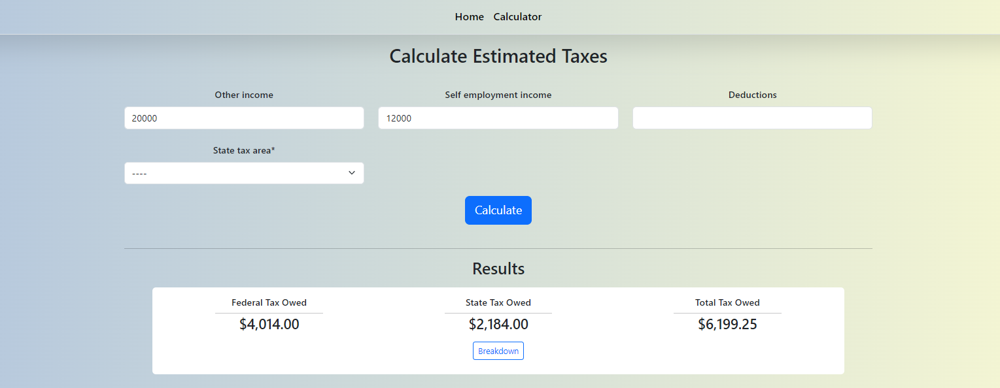

<h3>This is my custom tax calculator built in Django</h3>

Currently the state tax is only set up for the state of Maryland.

<h3>Detail View</h3>

<h3>Estimated quarterly tax payment section for the self-employed</h3>

