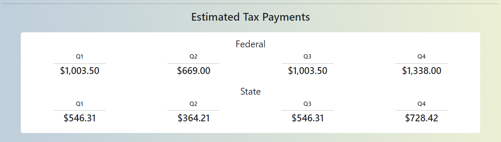

<h3>This is my custom tax calculator built in Django</h3>
Custom tax calculator that accounts for self-employment tax, quarterly payments, and more in the state of Maryland.

<h3>Detail View</h3>

<h3>Estimated quarterly tax payment section for the self-employed</h3>

