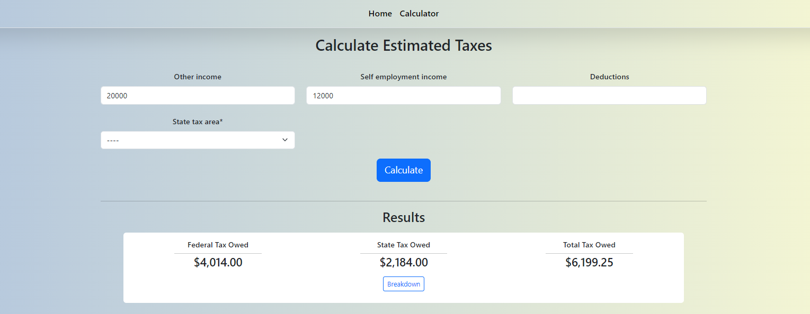
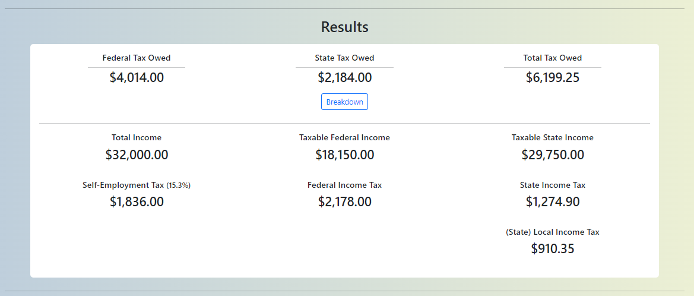
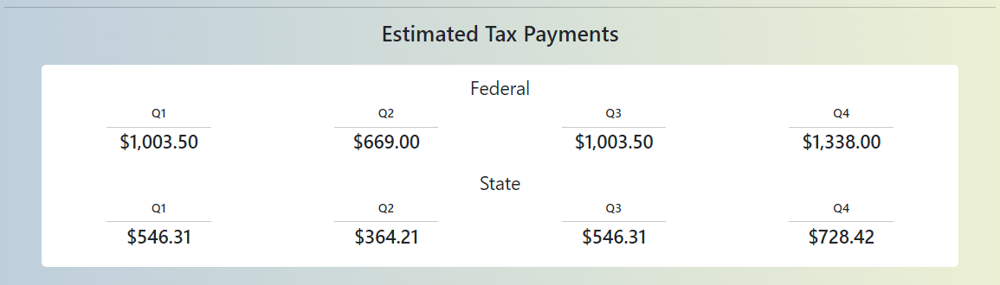

<h3>This is my custom tax calculator built with Django and Bootstrap</h3>

Currently the state tax is only set up for one state, but a scalable solution to include other states is in the works.

<h3>Detail View</h3>

<h3>Estimated quarterly tax payment section for the self-employed</h3>

